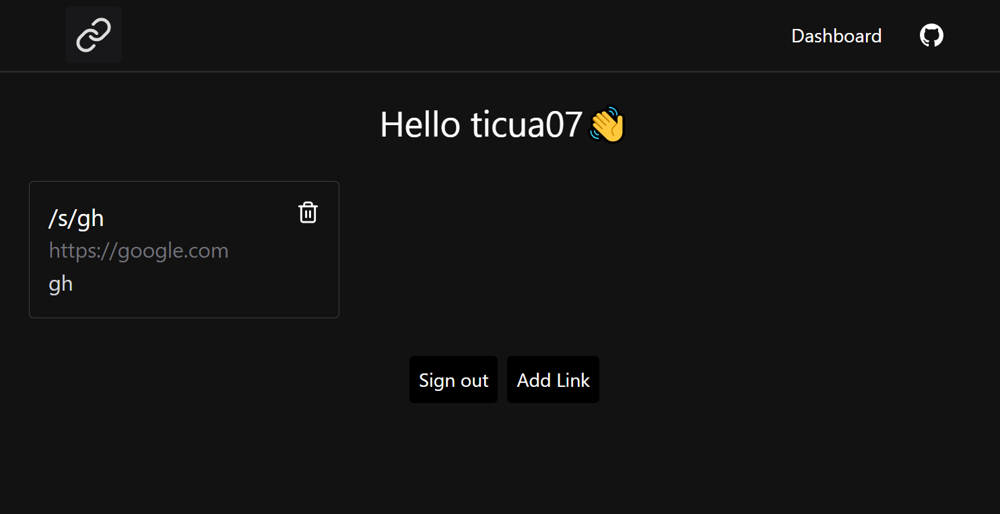

# Astro Shortener - Shorten Links with Custom Slugs
Astro Shortener allows you to shorten links with custom slugs, making sharing easier and more memorable.



[](https://stackblitz.com/github/ticua07/astro-shortener/)


## 💻 Getting started
- Fork this project: [Here](https://github.com/ticua07/astro-shortener/fork)
- Clone the repository:
```
git clone git@github.com:YOUR_USER/astro-shortener.git
```
- [Create a new  Github OAuth App](https://github.com/settings/applications/new)
- Create and .env file with the following variables:
```
# You can get the secret from https://generate-secret.vercel.app/32
AUTH_SECRET=
# Github OAuth
GITHUB_CLIENT_ID=
GITHUB_CLIENT_SECRET=
POSTGRES_URL_NON_POOLING=
POSTGRES_PRISMA_URL=
```
- Install dependencies:
```sh
# recommended
pnpm install
#or
npm install
# or
yarn install
```
- Finally run:
```
# Push your DB:
npx prisma db push
npx prisma generate

# Run the project:
npm run dev
```


## 🚀 Project Structure

```text
/
├── public/
│   └── favicon.svg
└───src
│   ├───components
│   │   └───links
│   ├───layouts
│   ├───pages
│   │   ├───add/
│   │   ├───api/
│   │   │   ├───create
│   │   │   ├───delete
│   │   │   └───slugs
│   │   ├───dashboard
│   │   └───s/
│   └───utils/
└── package.json
```

Any static assets, like images, are placed in the `public/` directory.

## 🧞 Commands

All commands are run from the root of the project, from a terminal:

| Command                   | Action                                           |
| :------------------------ | :----------------------------------------------- |
| `npm install`             | Installs dependencies and runs prisma postinstall|
| `npm run dev`             | Starts local dev server at `localhost:4321`      |
